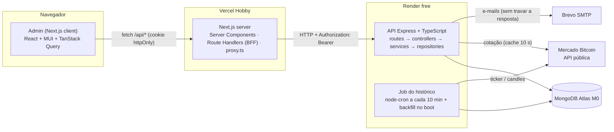
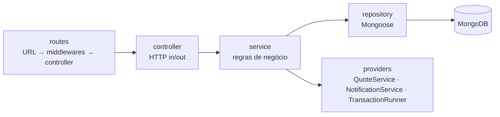
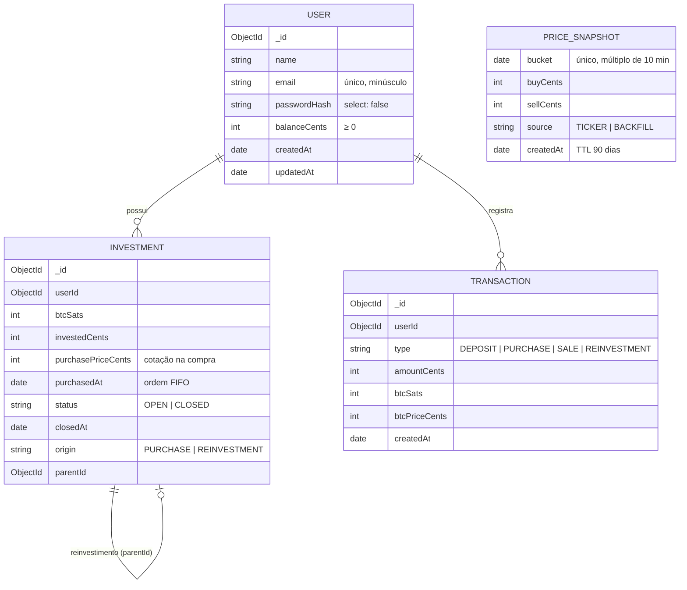
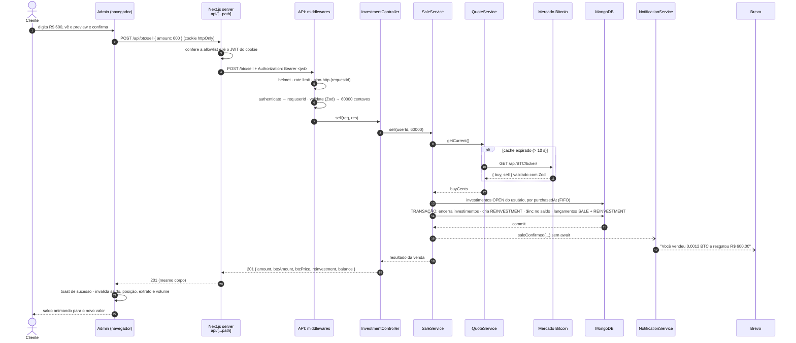

# Arquitetura: Bitcoinzz v2

> Como o sistema é montado: componentes, modelo de dados, o caminho de uma requisição, decisões e verificações de documentação.
> Requisitos em [PRD.md](PRD.md) · fases em [ROADMAP.md](ROADMAP.md).
> Última atualização: 06/10/2026.

## 1. Componentes



| Componente | Responsabilidade |
|---|---|
| **Admin (client)** | Telas, validação de formulários (RHF + Zod), cache e atualização automática dos dados (TanStack Query), animações |
| **Next.js server (BFF)** | Guarda o JWT em cookie httpOnly e repassa as chamadas para a API com o header `Authorization`; protege rotas (`proxy.ts`); lê o perfil em Server Component |
| **API** | Regras de negócio, validação, autenticação, persistência, integrações e documentação (`/docs`) |
| **Job do histórico** | Grava a cotação a cada 10 min e completa as lacunas das últimas 24 h quando a API acorda |
| **MongoDB Atlas** | Usuários, investimentos, extrato e histórico; transações multi-documento; TTL de 90 dias no histórico |
| **Mercado Bitcoin** | Fonte da cotação (`ticker`) e dos candles usados no backfill |
| **Brevo** | Envio dos e-mails de depósito, compra e venda |

## 2. Stack

Versões conferidas no npm em 06/10/2026; as definitivas ficam fixadas nos `package.json`.

| Camada | Tecnologias |
|---|---|
| API | Node 24 · Express 5.2 · TypeScript 6.0.x · Mongoose 9 · Zod 4 · jsonwebtoken · bcryptjs · pino + pino-http · node-cron 4 · Nodemailer · helmet · express-rate-limit · swagger-ui-express · dayjs |
| Front | Next.js 16 (App Router) · React 19 · MUI 9 + @mui/material-nextjs · MUI X Charts e Date Pickers · TanStack Query 5 · React Hook Form + Zod · Motion · sonner · react-number-format · dayjs |
| Qualidade | Vitest · Supertest · mongodb-memory-server · Testing Library · ESLint + typescript-eslint · Prettier |
| Infra | Docker Compose (dev local) · Render (API) · Vercel (front) · MongoDB Atlas M0 · Brevo |

## 3. Backend

### 3.1 Estrutura de pastas

```
backend/
├── docs/openapi.yaml            # Swagger (design-first), servido em /docs
├── src/
│   ├── server.ts                # bootstrap: env → banco → job → listen; graceful shutdown
│   ├── app.ts                   # createApp(container): middlewares globais, rotas, /docs, 404, erros
│   ├── container.ts             # composition root: cria repositories → services → controllers
│   ├── routes.ts                # junta os routers dos módulos
│   ├── config/                  # env.ts (Zod), database.ts, logger.ts
│   ├── shared/
│   │   ├── errors/              # AppError e subclasses
│   │   ├── http/                # authenticate, validate, rate-limit, error-handler, not-found
│   │   ├── database/            # TransactionRunner
│   │   ├── money.ts             # centavos/satoshis ↔ decimais; conversões com BigInt
│   │   └── dates.ts             # fuso America/Sao_Paulo, início do dia, slots de 10 min
│   └── modules/
│       ├── users/  auth/  account/  quotes/  investments/
│       └── transactions/  history/  notifications/
└── tests/  unit/  integration/  helpers/
```

### 3.2 Camadas



- **routes:** só ligam URL, middlewares (`authenticate`, `validate(schema)`) e o método do controller.
- **controller:** lê o `req` já validado, chama um service e devolve status + JSON. Não tem regra de negócio nem Mongoose.
- **service:** concentra as regras. As dependências chegam pelo construtor (injeção de dependência manual, montada no `container.ts`). Por isso os testes unitários trocam repositories e providers por fakes.
- **repository:** a única camada que importa models do Mongoose; converte documentos em objetos simples.
- **Erros:** services lançam `AppError` (`BadRequest` 400, `Unauthorized` 401, `Conflict` 409, `BusinessRule` 422, `ServiceUnavailable` 503). O `error-handler` responde sempre `{ statusCode, message, details? }`. Erros do Zod viram 400 com `details` por campo. Erros inesperados viram 500 e são logados com a stack.
- **Express 5:** promessas rejeitadas nos handlers chegam sozinhas ao `error-handler`, sem try/catch em cada controller.
- **Transações:** `TransactionRunner.run(fn)` usa `mongoose.connection.transaction()` com `transactionAsyncLocalStorage`. Toda operação dentro de `fn` entra na mesma transação sem precisar passar a `session`. O Mongo refaz a transação automaticamente em conflitos transitórios.

### 3.3 Dinheiro

- R$ é guardado em **centavos** (`int`) e BTC em **satoshis** (`int`, 1 BTC = 100.000.000 sats). Isso elimina erros como `0.1 + 0.2 !== 0.3`.
- As conversões com preço usam `BigInt`:
  - `centsToSats(cents, price) = floor(cents × 1e8 / price)`;
  - `satsToCents(sats, price) = floor(sats × price / 1e8)`;
  - na venda parcial, `ceil` garante que o BTC vendido cubra o valor pedido.
- A API recebe e devolve decimais (R$ com 2 casas, BTC com 8). A conversão acontece só nas bordas: schemas Zod e presenters.

## 4. Modelo de dados



| Coleção | Índices | Para quê |
|---|---|---|
| `users` | `{ email: 1 }` único | Login e e-mail duplicado (409) |
| `investments` | `{ userId: 1, status: 1, purchasedAt: 1 }` | Posição e fila FIFO da venda |
| `transactions` | `{ userId: 1, createdAt: -1 }` · `{ type: 1, createdAt: 1 }` | Extrato por período · volume do dia |
| `pricesnapshots` | `{ bucket: 1 }` único · `{ createdAt: 1 }` TTL de 90 dias | Job idempotente (sem duplicar slots) · expurgo automático |

- O BTC do cliente **não** fica guardado no usuário: é a soma de `btcSats` dos investimentos `OPEN`, a fonte única da verdade.
- O saldo em R$ fica no usuário e só muda de forma atômica (`$inc` com condição), sempre na mesma transação do lançamento no extrato.

## 5. Contrato da API

Alinhado à coleção Postman oficial do desafio. Erros no formato `{ statusCode, message, details? }`.

| Método | Rota | Auth | Entrada | Sucesso | Erros |
|---|---|---|---|---|---|
| POST | `/account` | – | `{ name, email, password }` | 201 `{ id, name, email }` | 400, 409 |
| POST | `/login` | – | `{ email, password }` | 200 `{ token }` | 400, 401 |
| GET | `/account` | ✔ | – | 200 `{ id, name, email }` | 401 |
| POST | `/account/deposit` | ✔ | `{ amount }` | 201 `{ balance }` | 400 |
| GET | `/account/balance` | ✔ | – | 200 `{ balance }` | 401 |
| GET | `/btc/price` | ✔ | – | 200 `{ buy, sell, updatedAt }` | 503 |
| POST | `/btc/purchase` | ✔ | `{ amount }` (R$) | 201 `{ amount, btcAmount, btcPrice, balance }` | 400, 422, 503 |
| POST | `/btc/sell` | ✔ | `{ amount }` (R$) | 201 `{ amount, btcAmount, btcPrice, reinvestment?, balance }` | 400, 422, 503 |
| GET | `/btc` | ✔ | – | 200 `{ summary, investments[] }` | 503 |
| GET | `/extract` | ✔ | `?from=YYYY-MM-DD&to=YYYY-MM-DD` | 200 `[{ id, type, amount, btcAmount?, btcPrice?, createdAt }]` | 400 |
| GET | `/volume` | ✔ | – | 200 `{ date, bought, sold }` | 401 |
| GET | `/history` | ✔ | – | 200 `[{ timestamp, buy, sell, source }]` | 401 |
| GET | `/health` | – | – | 200 `{ status, database }` | 503 |
| GET | `/docs` | – | – | Swagger UI | – |

## 6. Caminho de uma mensagem: venda de R$ 600

Do clique no botão até o e-mail. É o fluxo mais completo do sistema.



Pontos de falha e como cada um aparece para o cliente:

| Onde | O que acontece | O que o cliente vê |
|---|---|---|
| Cookie ausente ou expirado | O `proxy.ts` redireciona; o BFF responde 401 e apaga o cookie | Tela de login |
| Validação (Zod) | 400 com `details` por campo | Mensagem no campo do formulário |
| Mercado Bitcoin fora do ar | 503 | Toast "Cotação indisponível, tente novamente" |
| Posição insuficiente | 422 | Toast explicando o valor máximo disponível |
| Conflito de escrita simultânea | A transação é refeita automaticamente | Nada (transparente) |
| Falha no SMTP | Logada; não afeta a venda | Nada; a venda já foi concluída |
| API dormindo (Render free) | O BFF espera até ~90 s | Aviso "Acordando o servidor…" |

## 7. Jobs: histórico de cotações

- **Coleta:** `node-cron` com `*/10 * * * *` no fuso `America/Sao_Paulo`, além de uma execução no boot.
  - Cada execução faz upsert por `bucket` (horário arredondado para baixo em múltiplos de 10 min).
  - O índice único em `bucket` torna o job **idempotente**: com várias instâncias da API, só um registro por slot sobrevive.
- **Backfill:** como a API dorme no plano gratuito, no boot o serviço calcula quais dos 144 slots das últimas 24 h estão vazios e os preenche com os candles públicos do Mercado Bitcoin.
  - Esses pontos são marcados com `source: BACKFILL`.
  - São aproximados, porque o candle traz o preço negociado e não o par compra/venda.
  - O endpoint será conferido na doc oficial antes da Fase 8.
- **Expurgo:** índice TTL de 90 dias em `createdAt`. O próprio MongoDB remove os registros antigos (o monitor de TTL roda a cada ~60 s); não há código de limpeza.

## 8. Front

### 8.1 Estrutura

```
frontend/src/
├── app/
│   ├── layout.tsx               # fonte, metadata, Providers
│   ├── (auth)/login · register  # layout dividido com hero animado
│   ├── (app)/                   # layout protegido (Server Component lê o perfil)
│   │   └── dashboard · deposit · buy · sell · statement
│   └── api/                     # Route Handlers: auth/login · auth/register · auth/logout · [...path]
├── proxy.ts                     # Next 16 (antigo middleware): protege rotas
├── features/                    # auth · dashboard · trade · statement
├── components/                  # componentes visuais reutilizáveis
├── lib/                         # http, query-keys, format (Intl pt-BR)
└── theme/                       # tema MUI (tokens + overrides)
```

### 8.2 Sessão (BFF)

1. O login envia e-mail e senha para `/api/auth/login` (Route Handler). Ele chama `POST /login` na API e grava o JWT num cookie `httpOnly; Secure; SameSite=Lax` de **8 h**, a mesma validade do token.
2. Toda chamada de dados vai para `/api/<rota>`. O Route Handler `[...path]` aceita só as rotas da allowlist (`account`, `btc`, `extract`, `volume`, `history`), acrescenta `Authorization: Bearer` e repassa para `API_URL`. Essa variável só existe no servidor, por isso o navegador não conhece a URL da API.
3. Um 401 vindo da API apaga o cookie. O `proxy.ts` manda quem não tem cookie para `/login` e quem já está logado para fora de `/login`.

### 8.3 Dados

| Query | Atualização |
|---|---|
| Cotação | a cada 15 s |
| Posição, volume | a cada 30 s |
| Histórico | a cada 60 s |
| Saldo, extrato, perfil | ao abrir a tela e depois de cada operação |

- As mutations (depósito, compra, venda) invalidam saldo, posição, extrato e volume e mostram um toast.

### 8.4 Design tokens

| Token | Valor | Uso |
|---|---|---|
| `background.default` | `#0E0F13` | Fundo da aplicação |
| `background.paper` / elevado | `#16171D` / `#1D1E26` | Cards, diálogos, sidebar |
| `divider` | `rgba(255,255,255,.08)` | Bordas |
| `primary` | `#5865F2` (light `#7983F5`, dark `#4752C4`) | Ações, foco, destaques, glow |
| `success` / `error` / `warning` | `#23A55A` / `#F23F43` / `#F0B232` | Alta/compra · queda/venda · avisos |
| `text.primary` / `text.secondary` | `#F2F3F5` / `#A3A6B4` | Textos |
| BTC | `#F7931A` | Apenas no ícone do bitcoin |

- **Efeitos:** botão primário com gradiente `#5865F2 → #7983F5`, que no hover sobe 2 px com glow `0 8px 24px rgba(88,101,242,.45)` e no clique faz `scale(.98)`. Cards com borda que acende em blurple. Inputs com anel de foco blurple. Indicador deslizante no menu ativo (`layoutId` do Motion).
- **Movimento:** transições de 150–250 ms, entrada escalonada dos cards e contador animado no saldo. Tudo é desativado com `prefers-reduced-motion`.

## 9. Segurança

| Ameaça | Controle |
|---|---|
| Roubo de token via XSS | JWT só em cookie httpOnly; o JavaScript do navegador nunca o lê |
| CSRF | Cookie `SameSite=Lax`; mutações apenas via `POST` com JSON |
| Força bruta no login | Até 10 senhas erradas **por e-mail** a cada 15 min (o BFF faz todos chegarem com o IP da Vercel, por isso a chave não é o IP); cadastro limitado a 30/h por IP |
| Enumeração de usuários | Login com mensagem genérica "E-mail ou senha inválidos" e tempo de resposta igual (compara um hash fictício quando o e-mail não existe) |
| Senhas vazadas do banco | Hash bcrypt (custo 10); `passwordHash` com `select: false` |
| Entrada maliciosa | Zod em todo body e query; `express.json({ limit: '10kb' })` |
| Headers inseguros | helmet; `x-powered-by` desligado |
| Segredos | `.env` fora do git; `env.ts` valida na subida (`JWT_SECRET` com ≥ 32 caracteres) |
| Vazamento em logs | `redact` do pino em `authorization`, `password` e cookies |

## 10. Ambientes e custo

| Ambiente | Front | API | Banco | E-mail | Custo |
|---|---|---|---|---|---|
| Local (manual) | `next dev` :3000 | `tsx watch` :3333 | Atlas M0 (database atual) | Console (sem SMTP) | R$ 0 |
| Local (Docker) | container `web` | container `api` | container `mongo:8` (replica set) | Console ou Brevo | R$ 0 |
| Produção | Vercel Hobby | Render free | Atlas M0 | Brevo free | R$ 0 |

Limites que importam (verificados; ver seção 12):
- **Render:** dorme após 15 min sem tráfego, cerca de 1 min para acordar, 750 h/mês por workspace.
- **Vercel Hobby:** uso não comercial; funções com até 300 s.
- **Atlas M0:** 0,5 GB; pausa após 30 dias sem uso.
- **Brevo:** 300 e-mails/dia.

## 11. Registro de decisões

| # | Decisão | Alternativas consideradas | Motivo | Decidido por |
|---|---|---|---|---|
| D01 | Manter MongoDB + Mongoose | PostgreSQL + Prisma | Já conhecido e já configurado no Atlas; TTL nativo; transações no replica set | Autor |
| D02 | MUI + TanStack Query | MUI + Redux Toolkit; Tailwind + shadcn | MUI é o preferido do desafio; TanStack Query é o padrão atual para dados do servidor | Autor |
| D03 | Testes, Docker Compose e Swagger | Redis (cache + fila) | Diferenciais de maior valor sem infraestrutura extra | Autor |
| D04 | Vercel (front) + Render (API) | Tudo no Render; só local | Hospedagem nativa do Next.js; a API continua onde já está | Autor |
| D05 | JWT em cookie httpOnly via BFF | localStorage + chamada direta | Protege o token contra XSS e esconde a URL da API | Autor |
| D06 | Sessão de 8 h sem refresh token | 1 h; refresh token | Equilíbrio entre segurança e usabilidade no nível pleno | Autor |
| D07 | Brevo via SMTP (Nodemailer) | Gmail SMTP; Mailtrap; SendGrid; Resend | Grátis e sem prazo, entrega real; SendGrid e Resend não cabem no custo zero | Autor |
| D08 | Sem keep-alive no Render | Ping a cada 10 min | Não consumir as horas do workspace; compensado com backfill e pré-aquecimento | Autor |
| D09 | Dinheiro em inteiros (centavos e satoshis) | `Number` com `toFixed`; Decimal128 | Exatidão sem biblioteca extra; fácil de explicar | Autor (aprovado na Fase 0) |
| D10 | TypeScript 6.0.x | TypeScript 7.0 | O typescript-eslint 8.71 aceita TS `>=4.8.4 <6.1.0` | Autor (aprovado na Fase 0) |
| D11 | Regras de negócio da seção 5 do PRD | Leitura literal (reinvestir o R$ residual na cotação original) | A leitura literal cria ou destrói BTC | Autor (aprovado na Fase 0) |
| D12 | Swagger escrito à mão (`openapi.yaml`) | Gerado a partir dos schemas Zod | Mais simples de ler e manter neste tamanho de API | Autor (aprovado na Fase 0) |
| D13 | Rate limit do login por e-mail (10 erros / 15 min) | Por IP repassado pelo BFF; por IP simples | Atrás do BFF o IP é sempre o da Vercel; repassar o IP permitiria falsificação. Contra: alguém pode bloquear a conta de outra pessoa por até 15 min | Autor |

## 12. Verificações de documentação oficial

Regra do projeto: antes de cada integração, consultar a fonte oficial atual e registrar aqui.

| Data | Item | Fonte | Resultado |
|---|---|---|---|
| 06/10/2026 | Contrato da coleção Postman do desafio | [desafio-postman.json](https://cdn.eduzzcdn.com/files/desafio-postman.json) | Rotas `/account`, `/login`, `/account/deposit`, `/account/balance`, `/btc/price`, `/btc`, `/btc/purchase`, `/btc/sell` (`amount` em R$), `/extract`, `/volume`, `/history`; erros `{ statusCode, message }` |
| 06/10/2026 | Ticker do Mercado Bitcoin (URL do desafio) | `GET https://www.mercadobitcoin.net/api/BTC/ticker/` (chamada real) | HTTP 200; `ticker.buy` e `ticker.sell` vêm como **string** decimal. ⚠️ A doc oficial ainda será conferida na Fase 4 |
| 06/10/2026 | Ticker v4 do Mercado Bitcoin | `GET https://api.mercadobitcoin.net/api/v4/tickers?symbols=BTC-BRL` (chamada real) | HTTP 200; mesmos campos. Alternativa caso a v3 seja desligada |
| 06/10/2026 | Versões das bibliotecas | Registro do npm (`npm view`) | express 5.2.1 · mongoose 9.11.0 · zod 4.6.5 · next 16.3.8 · react 19.3.0 · @mui/material 9.4.0 · @tanstack/react-query 5.104.1 · vitest 5.0.3 · typescript 7.0.2 (latest) / 6.0.3 |
| 06/10/2026 | Compatibilidade do typescript-eslint | Registro do npm (peerDependencies 8.71.1) | `typescript >=4.8.4 <6.1.0` → usar TS 6.0.x |
| 06/10/2026 | Next.js 16: middleware → proxy | [nextjs.org: proxy](https://nextjs.org/docs/app/api-reference/file-conventions/proxy) | "Middleware is deprecated and renamed to Proxy"; roda no runtime Node.js por padrão |
| 06/10/2026 | Transações no Mongoose | [mongoosejs.com: transactions](https://mongoosejs.com/docs/transactions.html) | A opção `transactionAsyncLocalStorage` existe na doc atual |
| 06/10/2026 | Render free | [render.com/docs/free](https://render.com/docs/free) | Dorme após 15 min sem tráfego; cerca de 1 min para acordar; 750 h/mês por workspace; ao esgotar, os serviços free são suspensos até o mês seguinte |
| 06/10/2026 | Vercel Hobby | [vercel.com/docs/plans/hobby](https://vercel.com/docs/plans/hobby) | Grátis; somente uso pessoal e não comercial; funções com até 300 s; 1 milhão de invocações/mês |
| 06/10/2026 | Atlas M0 | [mongodb.com: free cluster limits](https://www.mongodb.com/docs/atlas/reference/free-shared-limitations/) | 0,5 GB; 100 operações/s; 500 conexões; pausa após 30 dias sem uso. ⚠️ Suporte a transações no M0 ainda será confirmado na Fase 3 |
| 06/10/2026 | Brevo (plano grátis) | [brevo.com/pricing](https://www.brevo.com/pricing/) e páginas oficiais de SMTP | 300 e-mails/dia, sem prazo e sem cartão; SMTP e API incluídos. ⚠️ Configuração SMTP e verificação de remetente serão conferidas na Fase 3 |
| 06/10/2026 | SendGrid | [Twilio changelog](https://www.twilio.com/en-us/changelog/sendgrid-free-plan) · [suporte](https://support.sendgrid.com/hc/en-us/articles/35270136965403-Twilio-SendGrid-Trial-Account-Plan) | Plano grátis encerrado em 27/05/2025; contas novas têm trial de 60 dias (100/dia). Descartado (custo zero) |
| 06/10/2026 | Resend | [resend.com/pricing](https://resend.com/pricing) · [doc 403 resend.dev](https://resend.com/docs/knowledge-base/403-error-resend-dev-domain) | 3.000/mês e 100/dia; sem domínio próprio, só envia para o e-mail da conta. Descartado |
| 06/10/2026 | Mailtrap Sandbox | [mailtrap.io/pricing](https://mailtrap.io/pricing/) | 50 e-mails de teste/mês; não entrega a destinatários reais |
| 06/10/2026 | `Connection#transaction()` (Fase 1) | [mongoosejs.com: transactions](https://mongoosejs.com/docs/transactions.html) | Embrulha o `withTransaction()`: faz commit, abort em erro e repete em erro transitório; devolve o retorno da função. Com `transactionAsyncLocalStorage`, não precisa passar a `session`. Testado num replica set em memória |
| 06/10/2026 | Erros em handlers async no Express 5 (Fase 1) | [expressjs.com: error handling](https://expressjs.com/en/guide/error-handling.html) | "Route handlers and middleware that return a Promise call `next(value)` automatically when they reject or throw." Error handler com 4 argumentos, registrado por último |
| 06/10/2026 | Locale do Zod 4 (Fase 1) | [zod.dev: error customization](https://zod.dev/error-customization) | `z.config(z.locales.pt())` existe, mas as mensagens são em português de Portugal ("Demasiado pequeno…"). Usado só como fallback; os schemas terão mensagens próprias em pt-BR |
| 06/10/2026 | npm 11: scripts de instalação (Fase 1) | Saída do `npm install` | O npm bloqueia o `postinstall` do esbuild até aprovação (`npm install-scripts approve`). O tsx e o Vitest funcionam sem ele (o binário vem do pacote opcional da plataforma) |
| 06/10/2026 | express-rate-limit 8.7 (Fase 2) | [Configuração oficial](https://express-rate-limit.mintlify.app/reference/configuration) | Opção `limit` (antigo `max`), `skipSuccessfulRequests` (não conta status < 400), `keyGenerator` customizável, `standardHeaders: 'draft-8'`, `handler` próprio. Alerta da doc: configurar `trust proxy` corretamente |
| 06/10/2026 | jsonwebtoken 9.0.3 e bcryptjs 3.0.3 (Fase 2) | Registro do npm | O bcryptjs 3 já traz os tipos; o jsonwebtoken usa `@types/jsonwebtoken`. O algoritmo é fixado em HS256 no `verify`, contra a troca do `alg` |

**Pendentes**, a conferir antes da fase indicada:
- Doc oficial do ticker e dos candles do Mercado Bitcoin, com limites de requisição (Fases 4 e 8).
- Transações no Atlas M0 e configuração SMTP do Brevo com Nodemailer (Fase 3).
- APIs do node-cron 4 (Fase 8) e do swagger-ui-express (Fase 9).
- Transações no Atlas M0 de verdade: o teste da Fase 1 rodou num replica set local em memória (Fase 3).
- Integração MUI 9 + Next 16 (Fase 10) e cookies em Route Handlers do Next 16 (Fase 11).
- MUI X Charts e Date Pickers (Fases 13 e 15).
- Configuração de deploy no Render e na Vercel (Fase 17).
