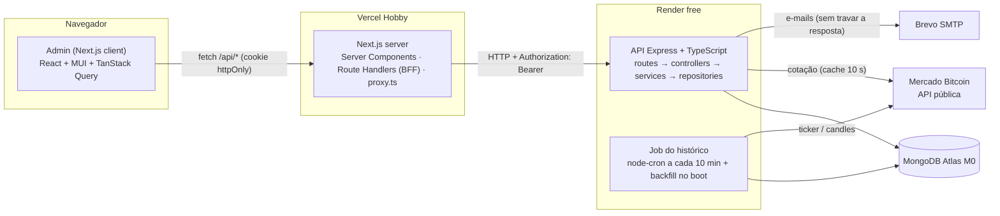
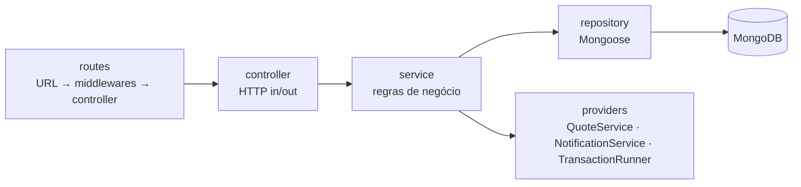
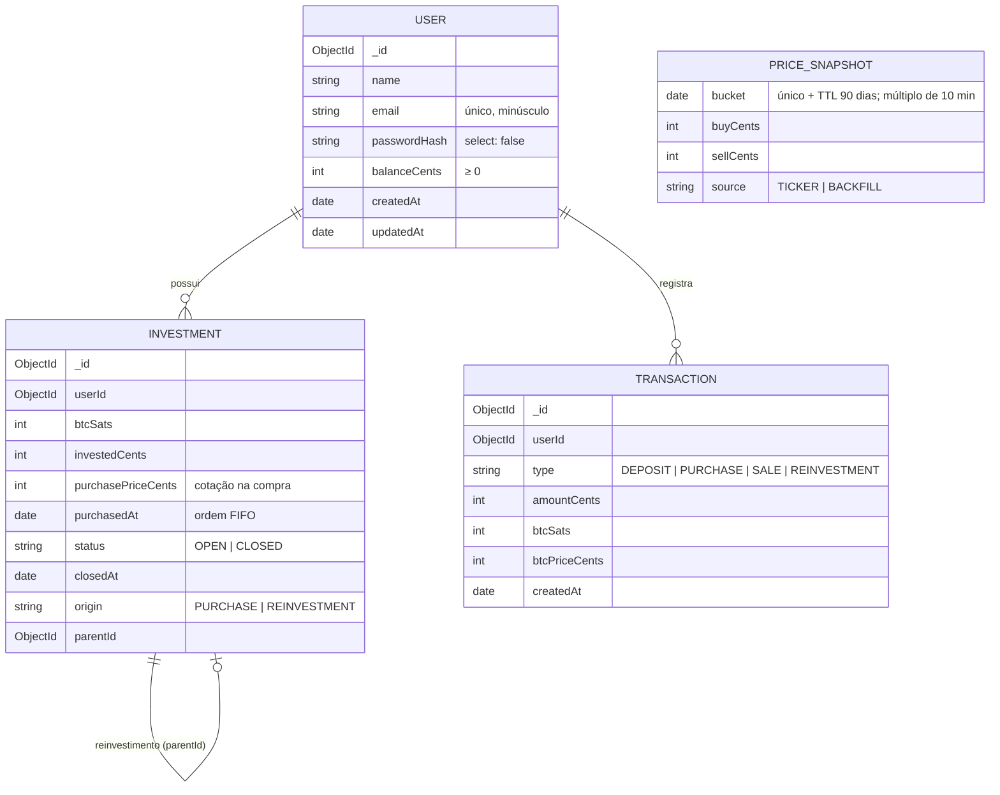
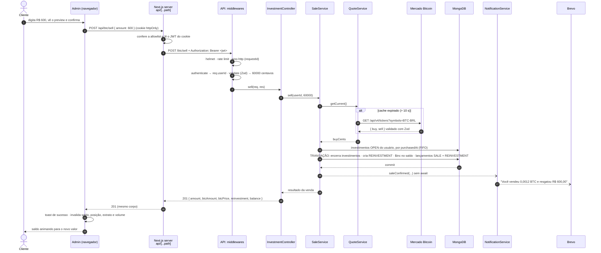

# Arquitetura: Bitcoinzz v2

> Como o sistema é montado: componentes, modelo de dados, o caminho de uma requisição, decisões e verificações de documentação.
> Requisitos em [PRD.md](PRD.md) · fases em [ROADMAP.md](ROADMAP.md).
> Última atualização: 06/10/2026.

## 1. Componentes



| Componente | Responsabilidade |
|---|---|
| **Admin (client)** | Telas, validação de formulários (RHF + Zod), cache e atualização automática dos dados (TanStack Query), animações |
| **Next.js server (BFF)** | Guarda o JWT em cookie httpOnly e repassa as chamadas para a API com o header `Authorization`; protege rotas (`proxy.ts`); lê o perfil em Server Component |
| **API** | Regras de negócio, validação, autenticação, persistência, integrações e documentação (`/docs`) |
| **Job do histórico** | Grava a cotação a cada 10 min e completa as lacunas das últimas 24 h quando a API acorda |
| **MongoDB Atlas** | Usuários, investimentos, extrato e histórico; transações multi-documento; TTL de 90 dias no histórico |
| **Mercado Bitcoin** | Fonte da cotação (`ticker`) e dos candles usados no backfill |
| **Brevo** | Envio dos e-mails de depósito, compra e venda |

## 2. Stack

Versões conferidas no npm em 06/10/2026; as definitivas ficam fixadas nos `package.json`.

| Camada | Tecnologias |
|---|---|
| API | Node 24 · Express 5.2 · TypeScript 6.0.x · Mongoose 9 · Zod 4 · jsonwebtoken · bcryptjs · pino + pino-http · node-cron 4 · Nodemailer · helmet · express-rate-limit · swagger-ui-express · dayjs |
| Front | Next.js 16 (App Router) · React 19 · MUI 9 + @mui/material-nextjs · MUI X Charts e Date Pickers · TanStack Query 5 · React Hook Form + Zod · Motion · sonner · dayjs |
| Qualidade | Vitest · Supertest · mongodb-memory-server · Testing Library · ESLint + typescript-eslint · Prettier |
| Infra | Docker Compose (dev local) · Render (API) · Vercel (front) · MongoDB Atlas M0 · Brevo |

## 3. Backend

### 3.1 Estrutura de pastas

```
backend/
├── docs/openapi.yaml            # Swagger (design-first), servido em /docs; validado por teste de contrato
├── src/
│   ├── server.ts                # bootstrap: .env → validação → banco → job → listen; graceful shutdown
│   ├── app.ts                   # createApp(container): middlewares globais, rotas, /docs, 404, erros
│   ├── container.ts             # composition root: cria repositories → services → controllers
│   ├── routes.ts                # junta os routers dos módulos
│   ├── config/                  # env.ts (Zod), database.ts, logger.ts
│   ├── types/express.d.ts       # acrescenta req.userId ao Request do Express
│   ├── shared/
│   │   ├── errors/              # AppError e subclasses (400, 401, 404, 409, 422, 429, 503)
│   │   ├── http/                # authenticate, validate, rate-limit, error-handler, not-found
│   │   ├── database/            # TransactionRunner
│   │   ├── money.ts             # centavos/satoshis ↔ decimais; conversões com BigInt
│   │   ├── format.ts            # R$ e BTC em pt-BR (textos de e-mail)
│   │   └── dates.ts             # fuso America/Sao_Paulo, início do dia, slots de 10 min
│   └── modules/
│       ├── docs/                # GET /, GET /docs (Swagger UI), GET /docs/openapi.json
│       ├── health/              # GET /health
│       ├── users/               # model + repository
│       ├── auth/                # cadastro, login, PasswordHasher, TokenService
│       ├── account/             # perfil, depósito, saldo
│       ├── notifications/       # Mailer (SMTP | console), templates, NotificationService
│       ├── transactions/        # lançamentos; extrato (StatementService) e volume (VolumeService); /extract, /volume
│       ├── quotes/              # MercadoBitcoinClient (v4) + QuoteService (cache 10 s); GET /btc/price
│       ├── investments/         # compra, posição e venda FIFO (Purchase/Position/SaleService); /btc/*
│       └── history/             # snapshots de 10 em 10 min: HistoryService, HistoryJob (node-cron), GET /history
└── tests/  unit/  integration/  helpers/   # fakes em memória + MongoDB em memória
```

### 3.2 Camadas



- **routes:** só ligam URL, middlewares (`authenticate`, `validate(schema)`) e o método do controller.
- **controller:** lê o `req` já validado, chama um service e devolve status + JSON. Não tem regra de negócio nem Mongoose.
- **service:** concentra as regras. As dependências chegam pelo construtor (injeção de dependência manual, montada no `container.ts`). Por isso os testes unitários trocam repositories e providers por fakes.
- **repository:** a única camada que importa models do Mongoose; converte documentos em objetos simples.
- **Erros:** services lançam `AppError` (`BadRequest` 400, `Unauthorized` 401, `Conflict` 409, `BusinessRule` 422, `ServiceUnavailable` 503). O `error-handler` responde sempre `{ statusCode, message, details? }`. Erros do Zod viram 400 com `details` por campo. Erros inesperados viram 500 e são logados com a stack.
- **Express 5:** promessas rejeitadas nos handlers chegam sozinhas ao `error-handler`, sem try/catch em cada controller.
- **Transações:** `TransactionRunner.run(fn)` usa `mongoose.connection.transaction()` com `transactionAsyncLocalStorage`. Toda operação dentro de `fn` entra na mesma transação sem precisar passar a `session`. O Mongo refaz a transação automaticamente em conflitos transitórios.

### 3.3 Dinheiro

- R$ é guardado em **centavos** (`int`) e BTC em **satoshis** (`int`, 1 BTC = 100.000.000 sats). Isso elimina erros como `0.1 + 0.2 !== 0.3`.
- As conversões com preço usam `BigInt`:
  - `centsToSats(cents, price) = floor(cents × 1e8 / price)`;
  - `satsToCents(sats, price) = floor(sats × price / 1e8)`;
  - na venda parcial, `ceil` garante que o BTC vendido cubra o valor pedido.
- A API recebe e devolve decimais (R$ com 2 casas, BTC com 8). A conversão acontece só nas bordas: schemas Zod e presenters.

## 4. Modelo de dados



| Coleção | Índices | Para quê |
|---|---|---|
| `users` | `{ email: 1 }` único | Login e e-mail duplicado (409) |
| `investments` | `{ userId: 1, status: 1, purchasedAt: 1 }` | Posição e fila FIFO da venda |
| `transactions` | `{ userId: 1, createdAt: -1 }` · `{ type: 1, createdAt: 1 }` | Extrato por período · volume do dia |
| `pricesnapshots` | `{ bucket: 1 }` **único e TTL de 90 dias** (um só índice) | Job idempotente (sem duplicar slots) e expurgo automático contado a partir do horário da cotação |

- O BTC do cliente **não** fica guardado no usuário: é a soma de `btcSats` dos investimentos `OPEN`, a fonte única da verdade.
- O saldo em R$ fica no usuário e só muda de forma atômica (`$inc` com condição), sempre na mesma transação do lançamento no extrato.

## 5. Contrato da API

Alinhado à coleção Postman oficial do desafio. Erros no formato `{ statusCode, message, details? }`.

| Método | Rota | Auth | Entrada | Sucesso | Erros |
|---|---|---|---|---|---|
| POST | `/account` | – | `{ name, email, password }` | 201 `{ id, name, email }` | 400, 409 |
| POST | `/login` | – | `{ email, password }` | 200 `{ token }` | 400, 401 |
| GET | `/account` | ✔ | – | 200 `{ id, name, email }` | 401 |
| POST | `/account/deposit` | ✔ | `{ amount }` | 201 `{ balance }` | 400 |
| GET | `/account/balance` | ✔ | – | 200 `{ balance }` | 401 |
| GET | `/btc/price` | ✔ | – | 200 `{ buy, sell, updatedAt }` | 503 |
| POST | `/btc/purchase` | ✔ | `{ amount }` (R$) | 201 `{ amount, btcAmount, btcPrice, balance }` | 400, 422, 503 |
| POST | `/btc/sell` | ✔ | `{ amount }` (R$) | 201 `{ amount, btcAmount, btcPrice, reinvestment: { amount, btcAmount, btcPrice } \| null, balance }` | 400, 422, 503 |
| GET | `/btc` | ✔ | – | 200 `{ summary: { invested, btcAmount, currentValue, returnPercent, currentBtcPrice }, investments: [{ id, purchasedAt, investedAmount, btcAmount, btcPriceAtPurchase, priceVariationPercent, currentValue, origin }] }` | 503 |
| GET | `/extract` | ✔ | `?from=YYYY-MM-DD&to=YYYY-MM-DD` (opcionais) | 200 `{ from, to, transactions: [{ id, type, amount, btcAmount, btcPrice, createdAt }] }` (`btcAmount`/`btcPrice` = `null` em depósitos) | 400 |
| GET | `/volume` | ✔ | – | 200 `{ date, bought, sold }` (BTC; todos os clientes; dia corrente em SP) | 401 |
| GET | `/history` | ✔ | – | 200 `[{ timestamp, buy, sell, source }]` (até 144 pontos, ordem crescente; `source`: `TICKER` ou `BACKFILL`) | 401 |
| GET | `/health` | – | – | 200 `{ status, database }` | 503 |
| GET | `/docs` | – | – | Swagger UI (`/docs/openapi.json` = spec) | – |
| GET | `/` | – | – | 200 `{ name, docs, health }` | – |

## 6. Caminho de uma mensagem: venda de R$ 600

Do clique no botão até o e-mail. É o fluxo mais completo do sistema.



Pontos de falha e como cada um aparece para o cliente:

| Onde | O que acontece | O que o cliente vê |
|---|---|---|
| Cookie ausente ou expirado | O `proxy.ts` redireciona; o BFF responde 401 e apaga o cookie | Tela de login |
| Validação (Zod) | 400 com `details` por campo | Mensagem no campo do formulário |
| Mercado Bitcoin fora do ar | 503 | Toast "Cotação indisponível, tente novamente" |
| Posição insuficiente | 422 | Toast explicando o valor máximo disponível |
| Conflito de escrita simultânea | A transação é refeita automaticamente | Nada (transparente) |
| Falha no SMTP | Logada; não afeta a venda | Nada; a venda já foi concluída |
| API dormindo (Render free) | O BFF espera até ~90 s | Aviso "Acordando o servidor…" |

## 7. Jobs: histórico de cotações

- **Coleta:** `node-cron` com `*/10 * * * *` no fuso `America/Sao_Paulo` (`noOverlap`), mais uma execução na subida da API.
  - Cada execução grava o slot atual (horário arredondado para baixo em múltiplos de 10 min) com `$setOnInsert` + `upsert`.
  - O índice único em `bucket` torna o job **idempotente**: com várias instâncias da API, só um registro por slot sobrevive (testado com 5 gravações simultâneas).
- **Backfill:** como a API dorme no plano gratuito, na subida o serviço calcula quais dos slots das últimas 24 h estão vazios e os preenche numa **única** chamada ao `/candles` (resolução 1 min).
  - Só existe candle nos minutos com negociação. Por isso cada slot recebe o **último candle que fechou antes dele**: o candle das 08:09 fecha às 08:10.
  - Esses pontos são marcados `source: BACKFILL` e são aproximados, porque o candle traz o preço negociado e não o par compra/venda (compra = venda).
  - O slot atual nunca vem do backfill: ele é coletado com a cotação real.
- **Expurgo:** o mesmo índice de `bucket` é TTL de 90 dias. O MongoDB remove sozinho os registros cujo horário passou de 90 dias (o monitor de TTL roda a cada ~60 s); não há código de limpeza.
- **Falhas:** erros de coleta ou de backfill viram aviso no log e nunca derrubam a API; o slot perdido é preenchido no próximo backfill.

## 8. Front

### 8.1 Estrutura

```
frontend/src/
├── app/
│   ├── layout.tsx               # fonte, metadata, Providers
│   ├── (auth)/login · register  # layout dividido com hero animado
│   ├── (app)/                   # AppShell (menu) + UserBadge em <Suspense> + error.tsx
│   │   └── dashboard · deposit · buy · sell · statement
│   └── api/                     # Route Handlers: auth/login · auth/register · auth/logout · [...path]
├── proxy.ts                     # Next 16 (antigo middleware): protege rotas
├── features/                    # auth · dashboard · trade · statement
├── components/                  # AppShell, UserBadge, StatCard, MoneyField, ConfirmDialog, FocusGroup e demais componentes visuais
├── lib/                         # http, query-keys, format (Intl pt-BR), money (centavos/satoshis), dates (dia em SP), time, use-now, download, nav
└── theme/                       # tema MUI (tokens + overrides)
```

**Área logada (Fase 13):**
- O `layout.tsx` de `(app)` é estático; só o `UserBadge` (Server Component que lê o cookie e busca o perfil) fica dentro de `<Suspense>`. Com o Cache Components, a casca (menu, títulos, skeletons) sai pronta no HTML e o nome do usuário chega em streaming (Partial Prerender, ◐ no build).
- O dashboard é um Client Component que busca cada bloco com o TanStack Query (seção 8.3). Cada card carrega e falha sozinho, com "Tentar de novo" próprio.
- Componentes cliente pré-renderizados não podem ler a hora (`new Date()`) durante o render. O "há 12 s" usa `useSyncExternalStore` com valor `null` no servidor e um relógio que anda a cada segundo no navegador.

### 8.2 Sessão (BFF)

1. **Login:** a tela envia e-mail e senha para `/api/auth/login` (Route Handler). Ele chama `POST /login` na API e grava o JWT no cookie `bitcoinzz_session` (`HttpOnly; Secure em produção; SameSite=Lax; Max-Age` = validade do JWT, 8 h). O token **não** volta no corpo da resposta.
2. **Cadastro:** `/api/auth/register` cria a conta e já faz o login automático.
3. **Dados:** toda chamada vai para `/api/<rota>`. O Route Handler `[...path]`:
   - só aceita a **allowlist exata** (método + caminho: `GET account`, `GET account/balance`, `POST account/deposit`, `GET btc`, `GET btc/price`, `POST btc/purchase`, `POST btc/sell`, `GET extract`, `GET volume`, `GET history`);
   - exige o cookie;
   - repassa com `Authorization: Bearer` para `API_URL`, uma variável só de servidor, então o navegador não conhece a URL da API.
4. **CSRF:** além do `SameSite=Lax`, os `POST` com `Origin` de outro site recebem 403.
5. **Erros:**
   - API demorando → 504; API fora do ar → 503 (com mensagem);
   - 401 da API (token expirado ou adulterado) apaga o cookie, e o navegador volta para o login com uma **recarga completa**, sem dados da sessão anterior na memória.
6. **Proteção das páginas:** o `proxy.ts` decide por `resolveAccess()` (`lib/access.ts`).
   - Sem cookie, as páginas protegidas levam a `/login?next=...`, e o `next` só aceita caminhos internos (contra "open redirect").
   - Com cookie, `/login` e `/register` levam ao dashboard.
   - Seguindo a doc do Next, o proxy **não é a única barreira**: o BFF também exige sessão.
7. **API dormindo:** `/api/health` "acorda" a API, e toda requisição passa por `serverWake.track()`. Se alguma passa de 2,5 s, aparece o aviso **"Acordando o servidor…"**, que some quando todas terminam.

### 8.3 Dados

| Query | Atualização |
|---|---|
| Cotação | a cada 15 s |
| Posição, volume | a cada 30 s |
| Histórico | a cada 60 s |
| Saldo, extrato, perfil | ao abrir a tela e depois de cada operação |

- As mutations (depósito, compra, venda) mostram um toast e atualizam o cache: o saldo vem na própria resposta (`setQueryData`), e posição, volume e extrato são invalidados (buscados de novo). Um 422 de saldo também busca o saldo de novo.
- **Prévia = mesmas regras da API.** O front calcula em inteiros (`lib/money.ts`: centavos, satoshis, BigInt), com o mesmo arredondamento (BTC para baixo) e as mesmas mensagens. A API continua sendo a autoridade: a compra usa a cotação do momento da confirmação, e a tela de sucesso mostra o resultado real devolvido por ela.

### 8.4 Design tokens

Definidos em `frontend/src/theme/tokens.ts`; o tema MUI fica em `theme.ts`. Escolhas do autor: fonte **Plus Jakarta Sans**, superfícies de **vidro fosco** (glassmorphism), **só dark** e animações **intensas**.

| Token | Valor | Uso |
|---|---|---|
| `background` | `#0B0C10` | Fundo, com manchas de luz animadas (blurple, violeta, azul) e uma grade sutil |
| `glass.background` | `rgba(22,23,29,0.42)` + `blur(18px) saturate(140%)` | Cards, diálogos e menus. Sem suporte a `backdrop-filter`, vira `#16171D` sólido |
| `glass.highlight` | `inset 0 1px 0 rgba(255,255,255,.07)` | Reflexo na borda superior do vidro |
| `border` | `rgba(255,255,255,.08)` | Bordas |
| `primary` | `#5865F2` (light `#7983F5`, dark `#4752C4`) | Ações, foco, destaques, glow |
| `secondary` (violeta) | `#9B59F6` | Fim do gradiente da marca (`#5865F2 → #9B59F6`) |
| `success` / `error` / `warning` | `#23A55A` / `#F23F43` / `#F0B232` | Alta/compra · queda/venda · avisos |
| `text.primary` / `text.secondary` | `#F2F3F5` / `#A3A6B4` | Textos |
| BTC | `#F7931A` | Apenas no ícone do bitcoin |

- **Hover:**
  - botão principal com gradiente, glow, elevação de 2 px e um brilho que atravessa o botão;
  - cards de vidro que acendem a borda em blurple e sobem 3 px;
  - **efeito de foco** (`FocusGroup`): o item sob o mouse ou o foco do teclado se destaca e os outros do grupo ficam foscos (opacidade, saturação e um leve desfoque). Só CSS (`:has`), sem estado no React;
  - inputs com anel de foco blurple; ícones que crescem.
- **Movimento:**
  - manchas de luz se movendo devagar no fundo (só `transform`);
  - entrada dos blocos em sequência (Motion, com 80 ms entre eles);
  - indicador "ao vivo" pulsando.
- **Acessibilidade:** quem ativa "reduzir movimento" no sistema não recebe animações (`MotionConfig reducedMotion="user"` + regra global no CSS); foco sempre visível; números tabulares.

## 9. Segurança

| Ameaça | Controle |
|---|---|
| Roubo de token via XSS | JWT só em cookie httpOnly; o JavaScript do navegador nunca o lê |
| CSRF | Cookie `SameSite=Lax`; mutações apenas via `POST` com JSON |
| Força bruta no login | Até 10 senhas erradas **por e-mail** a cada 15 min (o BFF faz todos chegarem com o IP da Vercel, por isso a chave não é o IP); cadastro limitado a 30/h por IP. Atrás do BFF esse limite vale para todos os cadastros somados, o que é aceitável para uma demonstração |
| Enumeração de usuários | Login com mensagem genérica "E-mail ou senha inválidos" e tempo de resposta igual (compara um hash fictício quando o e-mail não existe) |
| Senhas vazadas do banco | Hash bcrypt (custo 10); `passwordHash` com `select: false` |
| Entrada maliciosa | Zod em todo body e query; `express.json({ limit: '10kb' })` |
| Headers inseguros | helmet; `x-powered-by` desligado |
| IP falsificado no `X-Forwarded-For` | `trust proxy` só em produção (atrás do proxy do Render); em desenvolvimento o header é ignorado |
| Injeção de texto nos logs | `x-request-id` vindo do cliente só é aceito se for alfanumérico (até 64 caracteres); senão, a API gera um UUID |
| Segredos | `.env` fora do git; `env.ts` valida na subida (`JWT_SECRET` com ≥ 32 caracteres) |
| Vazamento em logs | `redact` do pino em `authorization`, `password` e cookies |

## 10. Ambientes e custo

| Ambiente | Front | API | Banco | E-mail | Custo |
|---|---|---|---|---|---|
| Local (manual) | `next dev` :3000 | `tsx watch` :3333 | Atlas M0 (database atual) | Console (sem SMTP) | R$ 0 |
| Local (Docker) | container `web` :3000 | container `api` :3333 | container `mongo:8` (replica set de 1 nó, volume) | Console ou Brevo | R$ 0 |
| Produção | Vercel Hobby | Render free | Atlas M0 | Brevo free | R$ 0 |

Limites que importam (verificados; ver seção 12):
- **Render:** dorme após 15 min sem tráfego, cerca de 1 min para acordar, 750 h/mês por workspace.
- **Vercel Hobby:** uso não comercial; funções com até 300 s.
- **Atlas M0:** 0,5 GB; pausa após 30 dias sem uso.
- **Brevo:** 300 e-mails/dia.

## 11. Registro de decisões

| # | Decisão | Alternativas consideradas | Motivo | Decidido por |
|---|---|---|---|---|
| D01 | Manter MongoDB + Mongoose | PostgreSQL + Prisma | Já conhecido e já configurado no Atlas; TTL nativo; transações no replica set | Autor |
| D02 | MUI + TanStack Query | MUI + Redux Toolkit; Tailwind + shadcn | MUI é o preferido do desafio; TanStack Query é o padrão atual para dados do servidor | Autor |
| D03 | Testes, Docker Compose e Swagger | Redis (cache + fila) | Diferenciais de maior valor sem infraestrutura extra | Autor |
| D04 | Vercel (front) + Render (API) | Tudo no Render; só local | Hospedagem nativa do Next.js; a API continua onde já está | Autor |
| D05 | JWT em cookie httpOnly via BFF | localStorage + chamada direta | Protege o token contra XSS e esconde a URL da API | Autor |
| D06 | Sessão de 8 h sem refresh token | 1 h; refresh token | Equilíbrio entre segurança e usabilidade no nível pleno | Autor |
| D07 | Brevo via SMTP (Nodemailer) | Gmail SMTP; Mailtrap; SendGrid; Resend | Grátis e sem prazo, entrega real; SendGrid e Resend não cabem no custo zero | Autor |
| D08 | Sem keep-alive no Render | Ping a cada 10 min | Não consumir as horas do workspace; compensado com backfill e pré-aquecimento | Autor |
| D09 | Dinheiro em inteiros (centavos e satoshis) | `Number` com `toFixed`; Decimal128 | Exatidão sem biblioteca extra; fácil de explicar | Autor (aprovado na Fase 0) |
| D10 | TypeScript 6.0.x | TypeScript 7.0 | O typescript-eslint 8.71 aceita TS `>=4.8.4 <6.1.0` | Autor (aprovado na Fase 0) |
| D11 | Regras de negócio da seção 5 do PRD | Leitura literal (reinvestir o R$ residual na cotação original) | A leitura literal cria ou destrói BTC | Autor (aprovado na Fase 0) |
| D12 | Swagger escrito à mão (`openapi.yaml`) | Gerado a partir dos schemas Zod | Mais simples de ler e manter neste tamanho de API | Autor (aprovado na Fase 0) |
| D13 | Rate limit do login por e-mail (10 erros / 15 min) | Por IP repassado pelo BFF; por IP simples | Atrás do BFF o IP é sempre o da Vercel; repassar o IP permitiria falsificação. Contra: alguém pode bloquear a conta de outra pessoa por até 15 min | Autor |
| D14 | `.env` carregado com `process.loadEnvFile()` nativo do Node | dotenv | Uma dependência a menos; o dotenv 18 imprime uma mensagem a cada inicialização. As variáveis do ambiente (Render) têm prioridade sobre o arquivo | Revisão geral |
| D15 | Cotação pelo endpoint v4 documentado (`/api/v4/tickers`) | URL v3 citada no desafio (`/api/BTC/ticker/`) | A v3 não consta mais na doc oficial (legado); a v4 traz os mesmos `buy` e `sell` | Autor |
| D16 | Compra e venda usam a cotação do cache (até 10 s) | Buscar cotação nova a cada operação | É a mesma cotação que o cliente vê no preview; respeita o limite de 1 req/s do Mercado Bitcoin; o extrato registra a cotação usada | Autor (aprovado na Fase 5) |
| D17 | Posição sem investimentos não consulta a cotação | Sempre consultar | O dashboard de quem ainda não investiu continua funcionando mesmo com o Mercado Bitcoin fora | Autor (aprovado na Fase 5) |
| D18 | Extrato responde `{ from, to, transactions }` | Lista simples de lançamentos | O front sabe qual período foi aplicado quando usa o padrão de 90 dias | Autor (aprovado na Fase 8) |
| D19 | Um único índice `{ bucket }` único + TTL | Índice único em `bucket` + TTL em `createdAt` | Testado: o MongoDB aceita os dois no mesmo índice. Expurgo contado a partir do horário da cotação, inclusive nos pontos de backfill | Revisão técnica (Fase 8) |
| D20 | Swagger público em produção | Só em desenvolvimento; com Basic Auth | Projeto de portfólio: o avaliador testa pelo navegador. A API já é pública, e as rotas exigem token e têm rate limit | Autor |
| D21 | Fonte Plus Jakarta Sans (via `next/font`) | Inter; Geist; Sora | Gosto do autor: mais arredondada, com cara de fintech | Autor |
| D22 | Glassmorphism com fundo animado | Sólido com borda sutil; gradientes vibrantes | Gosto do autor. Cuidado aplicado: vidro fosco o bastante para manter o contraste, e fallback sólido | Autor |
| D23 | Só tema dark | Dark + light | Foco no estilo do autor; uma paleta só | Autor |
| D24 | Animações intensas (efeito de foco, brilho nos botões, fundo animado) | Moderada; mínima | Gosto do autor. Só `transform`/`opacity`/`filter` e respeito a "reduzir movimento". O spotlight que seguia o mouse foi removido a pedido do autor (apagava as informações) | Autor |
| D25 | Manter `cacheComponents` (e `partialPrefetching`) ligado, como o create-next-app 16.4 gera | Desligar | Estável no Next 16 e será o padrão obrigatório na próxima versão principal. Impacto: leituras de cookies ficam dentro de `<Suspense>` (casca estática + streaming) | Revisão técnica (Fase 10) |
| D26 | BFF com allowlist exata (método + caminho) e checagem de `Origin` nos POST | Repassar tudo que vier em `/api/*` | Menor superfície de ataque: o navegador só alcança as 10 operações do admin; o `Origin` é uma segunda barreira contra CSRF | Revisão técnica (Fase 11) |
| D27 | Logout e sessão expirada fazem recarga completa da página | Navegação interna (`router.push`) | Garante que o cache do React Query e as rotas mantidas pelo Cache Components não guardem dados do usuário anterior | Revisão técnica (Fase 11) |
| D28 | Login e cadastro com layout dividido (hero + formulário) e checklist da senha ao vivo | Card centralizado; erro só ao enviar | Escolha do autor: vitrine do produto e menos frustração ao criar a senha | Autor |
| D29 | Menu lateral fixo no desktop e gaveta no celular | Barra superior com abas; menu recolhível | Escolha do autor: padrão de painel administrativo, com as 5 telas sempre à vista | Autor |
| D30 | Gráfico de área com o preço de venda; compra e venda no tooltip | Duas linhas (compra × venda); candles | Escolha do autor: compra e venda quase se sobrepõem na escala de 24 h, então duas linhas viram uma só; a área com gradiente é mais legível, e o tooltip mostra os dois valores | Autor |
| D31 | Campo de R$ "estilo app de banco" (dígitos entram pelos centavos), feito no projeto | Digitação livre formatada (`react-number-format`) | Escolha do autor: sem vírgula para errar e sem dependência nova; a regra é uma função pequena e testada (`parseMoneyInput`) | Autor |
| D32 | Depois de depositar ou comprar, o formulário vira um resumo com o resultado real e atalhos | Toast e voltar ao dashboard; toast e limpar o formulário | Escolha do autor: o usuário vê o que de fato aconteceu (BTC comprado, cotação usada, novo saldo) | Autor |
| D33 | Diálogo de confirmação só na compra; atalhos fixos no depósito e % do saldo na compra | Confirmar as duas; sem atalhos | Escolha do autor: a compra depende da cotação e gasta saldo; o depósito é simulado e direto | Autor |
| D34 | Prévia da venda mostra o plano FIFO (o que é vendido inteiro, em parte e a sobra reinvestida) | Só o BTC estimado e um texto | Escolha do autor: a regra fica visível antes de confirmar. A função (`salePreview`) espelha a da API e é testada com os mesmos casos | Autor |
| D35 | Datas do extrato com MUI X Date Pickers (MIT), em pt-BR | `<input type="date">` nativo | Escolha do autor: calendário no tema e digitação DD/MM/AAAA. O provider fica só no filtro do extrato, para o código carregar apenas nessa tela | Autor |
| D36 | Extrato em lista agrupada por dia, estilo app de banco | Tabela no desktop + cards no celular | Escolha do autor: um componente só para todas as larguras, com valor em destaque e sinal de entrada/saída | Autor |
| D37 | Extras do extrato: totais do período, filtro por tipo e CSV gerado no navegador | Sem extras | Escolha do autor. O CSV usa ";" e vírgula decimal (Excel em português) e exporta o que está na tela (respeita o filtro) | Autor |
| D38 | No Docker Compose, o `JWT_SECRET` é obrigatório num `.env` na raiz (sem ele, o compose recusa subir) | Segredo padrão "só local" no compose; gerado na primeira subida | Escolha do autor: seguro por padrão, nenhum segredo conhecido no repositório. Custo: um passo a mais (copiar o `.env.example` e gerar o segredo) | Autor |
| D39 | Docker só no modo produção (imagens multi-stage, iguais ao deploy) | Também um modo de desenvolvimento com hot reload | Escolha do autor: menos arquivos; para desenvolver, `npm run dev` continua | Autor |
| D40 | Banco do Docker começa vazio | Conta demo por comando ou automática | Escolha do autor: quem avalia cria a própria conta; o gráfico já aparece pelo backfill | Autor |

## 12. Verificações de documentação oficial

Regra do projeto: antes de cada integração, consultar a fonte oficial atual e registrar aqui.

| Data | Item | Fonte | Resultado |
|---|---|---|---|
| 06/10/2026 | Contrato da coleção Postman do desafio | [desafio-postman.json](https://cdn.eduzzcdn.com/files/desafio-postman.json) | Rotas `/account`, `/login`, `/account/deposit`, `/account/balance`, `/btc/price`, `/btc`, `/btc/purchase`, `/btc/sell` (`amount` em R$), `/extract`, `/volume`, `/history`; erros `{ statusCode, message }` |
| 06/10/2026 | Ticker do Mercado Bitcoin (URL do desafio) | `GET https://www.mercadobitcoin.net/api/BTC/ticker/` (chamada real) | HTTP 200; `ticker.buy` e `ticker.sell` vêm como **string** decimal. ⚠️ A doc oficial ainda será conferida na Fase 4 |
| 06/10/2026 | Ticker v4 do Mercado Bitcoin | `GET https://api.mercadobitcoin.net/api/v4/tickers?symbols=BTC-BRL` (chamada real) | HTTP 200; mesmos campos. Alternativa caso a v3 seja desligada |
| 06/10/2026 | Versões das bibliotecas | Registro do npm (`npm view`) | express 5.2.1 · mongoose 9.11.0 · zod 4.6.5 · next 16.3.8 · react 19.3.0 · @mui/material 9.4.0 · @tanstack/react-query 5.104.1 · vitest 5.0.3 · typescript 7.0.2 (latest) / 6.0.3 |
| 06/10/2026 | Compatibilidade do typescript-eslint | Registro do npm (peerDependencies 8.71.1) | `typescript >=4.8.4 <6.1.0` → usar TS 6.0.x |
| 06/10/2026 | Next.js 16: middleware → proxy | [nextjs.org: proxy](https://nextjs.org/docs/app/api-reference/file-conventions/proxy) | "Middleware is deprecated and renamed to Proxy"; roda no runtime Node.js por padrão |
| 06/10/2026 | Transações no Mongoose | [mongoosejs.com: transactions](https://mongoosejs.com/docs/transactions.html) | A opção `transactionAsyncLocalStorage` existe na doc atual |
| 06/10/2026 | Render free | [render.com/docs/free](https://render.com/docs/free) | Dorme após 15 min sem tráfego; cerca de 1 min para acordar; 750 h/mês por workspace; ao esgotar, os serviços free são suspensos até o mês seguinte |
| 06/10/2026 | Vercel Hobby | [vercel.com/docs/plans/hobby](https://vercel.com/docs/plans/hobby) | Grátis; somente uso pessoal e não comercial; funções com até 300 s; 1 milhão de invocações/mês |
| 06/10/2026 | Atlas M0 | [mongodb.com: free cluster limits](https://www.mongodb.com/docs/atlas/reference/free-shared-limitations/) | 0,5 GB; 100 operações/s; 500 conexões; pausa após 30 dias sem uso. ⚠️ Suporte a transações no M0 ainda será confirmado na Fase 3 |
| 06/10/2026 | Brevo (plano grátis) | [brevo.com/pricing](https://www.brevo.com/pricing/) e páginas oficiais de SMTP | 300 e-mails/dia, sem prazo e sem cartão; SMTP e API incluídos. ⚠️ Configuração SMTP e verificação de remetente serão conferidas na Fase 3 |
| 06/10/2026 | SendGrid | [Twilio changelog](https://www.twilio.com/en-us/changelog/sendgrid-free-plan) · [suporte](https://support.sendgrid.com/hc/en-us/articles/35270136965403-Twilio-SendGrid-Trial-Account-Plan) | Plano grátis encerrado em 27/05/2025; contas novas têm trial de 60 dias (100/dia). Descartado (custo zero) |
| 06/10/2026 | Resend | [resend.com/pricing](https://resend.com/pricing) · [doc 403 resend.dev](https://resend.com/docs/knowledge-base/403-error-resend-dev-domain) | 3.000/mês e 100/dia; sem domínio próprio, só envia para o e-mail da conta. Descartado |
| 06/10/2026 | Mailtrap Sandbox | [mailtrap.io/pricing](https://mailtrap.io/pricing/) | 50 e-mails de teste/mês; não entrega a destinatários reais |
| 06/10/2026 | `Connection#transaction()` (Fase 1) | [mongoosejs.com: transactions](https://mongoosejs.com/docs/transactions.html) | Embrulha o `withTransaction()`: faz commit, abort em erro e repete em erro transitório; devolve o retorno da função. Com `transactionAsyncLocalStorage`, não precisa passar a `session`. Testado num replica set em memória |
| 06/10/2026 | Erros em handlers async no Express 5 (Fase 1) | [expressjs.com: error handling](https://expressjs.com/en/guide/error-handling.html) | "Route handlers and middleware that return a Promise call `next(value)` automatically when they reject or throw." Error handler com 4 argumentos, registrado por último |
| 06/10/2026 | Locale do Zod 4 (Fase 1) | [zod.dev: error customization](https://zod.dev/error-customization) | `z.config(z.locales.pt())` existe, mas as mensagens são em português de Portugal ("Demasiado pequeno…"). Usado só como fallback; os schemas terão mensagens próprias em pt-BR |
| 06/10/2026 | npm 11: scripts de instalação (Fase 1) | Saída do `npm install` | O npm bloqueia o `postinstall` do esbuild até aprovação (`npm install-scripts approve`). O tsx e o Vitest funcionam sem ele (o binário vem do pacote opcional da plataforma) |
| 06/10/2026 | express-rate-limit 8.7 (Fase 2) | [Configuração oficial](https://express-rate-limit.mintlify.app/reference/configuration) | Opção `limit` (antigo `max`), `skipSuccessfulRequests` (não conta status < 400), `keyGenerator` customizável, `standardHeaders: 'draft-8'`, `handler` próprio. Alerta da doc: configurar `trust proxy` corretamente |
| 06/10/2026 | jsonwebtoken 9.0.3 e bcryptjs 3.0.3 (Fase 2) | Registro do npm | O bcryptjs 3 já traz os tipos; o jsonwebtoken usa `@types/jsonwebtoken`. O algoritmo é fixado em HS256 no `verify`, contra a troca do `alg` |
| 06/10/2026 | SMTP do Brevo (Fase 3) | [Brevo: SMTP integration](https://developers.brevo.com/docs/smtp-integration) · [Node.js example](https://developers.brevo.com/docs/node-smtp-relay-example) | Host `smtp-relay.brevo.com`, porta 587 com `secure: false` (465 = TLS direto); autenticação com a **SMTP key**, não a API key; cuidado com espaços ao copiar a chave |
| 06/10/2026 | Nodemailer 10 (Fase 3) | [nodemailer.com/smtp](https://nodemailer.com/smtp) | Opções `host`, `port`, `secure`, `auth`. Timeouts padrão longos (conexão 2 min, socket 10 min), por isso o projeto usa 10 s/10 s/20 s |
| 06/10/2026 | Transações no Atlas M0 (Fase 3) | [Free cluster limits](https://www.mongodb.com/docs/atlas/reference/free-shared-limitations/) · [Unsupported commands](https://www.mongodb.com/docs/atlas/unsupported-commands/) | O M0 é um replica set de 3 nós; `startTransaction`/`commitTransaction` não constam como limitados nem como não suportados. ⚠️ Confirmação prática pendente (credencial do Atlas) |
| 06/10/2026 | Transações no Atlas M0: teste prático | Smoke test contra o cluster do autor | ✅ Confirmado: MongoDB 8.0.34; depósito em transação (`$inc` + lançamento) com commit bem-sucedido; dados do teste removidos |
| 06/10/2026 | `process.loadEnvFile()` (revisão) | Teste prático no Node 24.20 | Não sobrescreve variáveis já definidas no ambiente; lança `ENOENT` se o arquivo não existir; não imprime nada |
| 06/10/2026 | API v4 do Mercado Bitcoin (Fase 4) | Spec oficial: [api.mercadobitcoin.net/api/v4/docs](https://api.mercadobitcoin.net/api/v4/docs) (`swagger.yaml`) | `GET /tickers?symbols=BTC-BRL` devolve uma lista; `buy`, `sell` e `last` em **texto**. Limite: **1 req/s por endpoint** e 500 req/min no total. `GET /candles`: resoluções `1m, 15m, 1h, 3h, 1d, 1w, 1M` (não há 10m), parâmetros `symbol`, `resolution`, `to` (obrigatório), `from` e `countback`; resposta em arrays `t, o, h, l, c`. O campo `date` do ticker diz "nanoseconds", mas o exemplo e a resposta real estão em segundos, por isso a API usa a própria hora da consulta como `updatedAt`. A URL v3 do desafio não aparece na doc |
| 06/10/2026 | node-cron 4 (Fase 8) | [README oficial](https://github.com/node-cron/node-cron) + tipos do pacote | `schedule(expr, fn, { name, timezone, noOverlap, ... })`; a tarefa inicia sozinha; `stop()`, `start()` e `destroy()`; expressão com 5 ou 6 campos (segundos opcionais) |
| 06/10/2026 | `/candles` do Mercado Bitcoin: teste prático (Fase 8) | Chamadas reais a `api.mercadobitcoin.net/api/v4/candles` | `countback=1440` e `from`/`to` de 27 h funcionam (1.440 e 1.291 candles). **Só há candle nos minutos com negociação** (180 lacunas em 1.440 minutos) |
| 06/10/2026 | Índice único + TTL no mesmo campo (Fase 8) | Teste prático no MongoDB 8 (memória) | `createIndex({ bucket: 1 }, { unique: true, expireAfterSeconds })` aceito; inserção duplicada recusada com o erro 11000 |
| 07/10/2026 | swagger-ui-express 5 (Fase 9) | [README oficial](https://github.com/scottie1984/swagger-ui-express) | `swaggerUi.serve` + `swaggerUi.setup(doc, { customSiteTitle, swaggerOptions })`; YAML lido com o pacote `yaml`. Teste prático: `/docs` redireciona (301) para `/docs/` e a interface renderiza sem bloqueio do CSP padrão do helmet |
| 07/10/2026 | Coleção Postman oficial com Newman 6 (Fase 9) | [desafio-postman.json](https://cdn.eduzzcdn.com/files/desafio-postman.json) + `npx newman@6 run` | 11 requisições, 0 falhas; todas as rotas reconhecidas. O login da coleção tem `"..."` como credenciais e precisa ser preenchido por quem a usa |
| 07/10/2026 | MUI 9 + Next 16 App Router (Fase 10) | [mui.com: Next.js integration](https://mui.com/material-ui/integrations/nextjs/) + `exports` do pacote | `AppRouterCacheProvider` de `@mui/material-nextjs/v16-appRouter` (o pacote 9.4 já traz o `v16`); fonte por `next/font` com variável CSS; tema em arquivo `'use client'` |
| 07/10/2026 | MUI 9: estilos por combinação de props (Fase 10) | Tipos do pacote (`styles/components.d.ts`) | A chave `containedPrimary` não existe mais. O caminho é `components.MuiButton.variants: [{ props: { variant, color }, style }]` |
| 07/10/2026 | create-next-app 16.4 e Cache Components (Fase 10) | `create-next-app --help` · [nextjs.org: cacheComponents](https://nextjs.org/docs/app/api-reference/config/next-config-js/cacheComponents) | O template gera `cacheComponents: true` + `partialPrefetching: true`; a doc diz que ambos serão o padrão obrigatório na próxima versão principal (decisão D25) |
| 07/10/2026 | `npm audit` do front (Fase 10) | `npm audit` / `npm audit --omit=dev` | **0** vulnerabilidades em produção. 5 "altas" só em ferramenta de lint (`braces`, via `eslint-config-next` → `fast-glob`), **sem versão corrigida**; o `--force` faria downgrade para o `eslint-config-next` 14. Risco aceito: afeta só o lint local |
| 07/10/2026 | `proxy.ts` do Next 16 (Fase 11) | [nextjs.org: proxy](https://nextjs.org/docs/app/api-reference/file-conventions/proxy) | Em `src/`, exportando `proxy(request)` e `config.matcher`; roda em Node.js; `request.cookies.has()`; `NextResponse.redirect`. A doc recomenda não depender só do proxy para autenticação |
| 07/10/2026 | `cookies()` e Route Handlers no Next 16 (Fase 11) | [nextjs.org: cookies](https://nextjs.org/docs/app/api-reference/functions/cookies) · [route.js](https://nextjs.org/docs/app/api-reference/file-conventions/route) | `cookies()` é assíncrono; `set`/`delete` só em Route Handlers e Server Functions; opções `httpOnly`, `secure`, `sameSite`, `maxAge`, `path`. `params` do catch-all é uma Promise (`{ path: string[] }`); `GET` é dinâmico por padrão |
| 07/10/2026 | React Hook Form + Zod 4 (Fase 12) | [README do @hookform/resolvers](https://github.com/react-hook-form/resolvers) + `peerDependencies` | `zodResolver` de `@hookform/resolvers/zod` aceita `zod ^3.25 \|\| ^4`; com schemas que transformam dados, usar `useForm<z.input<S>, unknown, z.output<S>>`. **Atenção:** o npm instalou o Zod 3 por causa do `eslint-plugin-react-hooks`; foi preciso fixar `zod@^4.6.5` no front |
| 07/10/2026 | Testes de componente (Fase 12) | Prática (Vitest 5 + jsdom 30 + Testing Library 16 + `@vitejs/plugin-react`) | Arquivos de componente pedem `// @vitest-environment jsdom`; `next/navigation` e `sonner` são simulados com `vi.mock` |
| 07/10/2026 | MUI X Charts 9.15 (Fase 13) | [mui.com/x/react-charts](https://mui.com/x/react-charts/) + `package.json` e tipos do pacote | `@mui/x-charts` (sem "pro") tem licença **MIT**: custo zero. `LineChart` com `area`, `curve`, `showMark` e `baseline: number \| 'min' \| 'max'`; tooltip próprio por `slots.tooltip`, montado com `ChartsTooltipContainer` + `useAxesTooltip()`; `<defs>` com gradiente entra como filho do gráfico |
| 07/10/2026 | Área do gráfico (Fase 13) | Prática (prints) | Sem `baseline`, a área vai até o valor 0, mesmo com o eixo Y começando em R$ 415 mil, e o gradiente fica chapado. Com `baseline: 'min'`, a área para no piso do eixo |
| 07/10/2026 | `new Date()` com Cache Components (Fase 13) | Erro do `next build` + [nextjs.org: cacheComponents](https://nextjs.org/docs/app/api-reference/config/next-config-js/cacheComponents) | O build falha com "encountered the unstable value `new Date()` in a Client Component" quando um componente pré-renderizado lê a hora no render. Solução usada: `useSyncExternalStore` com snapshot `null` no servidor |
| 07/10/2026 | Tooltip do MUI X dentro de card de vidro (Fase 13) | Código do `ChartsTooltipContainer` 9.15 + teste no navegador | O tooltip é um Popper `position: fixed` renderizado **dentro do gráfico** (`container` padrão). Um ancestral com `backdrop-filter` (o Card de vidro) vira o bloco de referência do `fixed`, e o tooltip aparece deslocado. Correção: `container={() => document.body}`. Conferido com a página rolada |

| 07/10/2026 | Campo de R$ com foco automático (Fase 14) | Prática (Chrome headless + teste com o cursor no início) | Com "R$ 0,00" no campo, o foco automático pode deixar o cursor no **início**, e o 1º dígito entrava antes dos zeros ("4" → R$ 40,00). Mover o cursor via `onSelect` do React não foi confiável na página pré-renderizada (o foco pode acontecer antes da hidratação, e o React não o vê). Solução: campo **vazio** no zero, com "R$ 0,00" como placeholder |

| 08/10/2026 | MUI X Date Pickers 9.15 (Fase 15) | [mui.com: getting started](https://mui.com/x/react-date-pickers/getting-started/) · [localization](https://mui.com/x/react-date-pickers/localization/) · [date picker](https://mui.com/x/react-date-pickers/date-picker/) · `npm view` | Pacote `@mui/x-date-pickers` com licença **MIT** (os componentes Pro ficam em outro pacote); aceita MUI 9, React 19 e dayjs ≥ 1.10.7. Adapter em `@mui/x-date-pickers/AdapterDayjs`; pt-BR com `ptBR` de `@mui/x-date-pickers/locales` (`localeText`) + `adapterLocale="pt-br"` e `import 'dayjs/locale/pt-br'`; `value`/`onChange` com objetos dayjs; `minDate`/`maxDate`; `slotProps.textField`; desktop ou celular decidido por `@media (pointer: fine)`. `npm audit --omit=dev`: 0 vulnerabilidades |
| 08/10/2026 | Tema dos Date Pickers v9 (Fase 15) | Tipos do pacote (`themeAugmentation`) | No v9 a opção `enableAccessibleFieldDOMStructure` não existe mais: o campo é sempre o `PickersTextField`, com o próprio `MuiPickersOutlinedInput` (o estilo do `MuiOutlinedInput` não se aplica sozinho). O popup é `MuiPickerPopper` (singular). Com `import type {} from '@mui/x-date-pickers/themeAugmentation'`, o TypeScript acusa nomes errados no tema |

| 08/10/2026 | Docker Desktop para Windows (Fase 16) | [docs.docker.com: install on Windows](https://docs.docker.com/desktop/setup/install/windows-install/) · [Docker Desktop license](https://docs.docker.com/subscription/desktop-license/) | Requisitos: Windows 11 64-bit 23H2 (build 22631) ou mais novo, WSL ≥ 2.1.5, 8 GB de RAM e virtualização ativa. Backend recomendado: WSL 2; instalação por usuário, sem reiniciar e sem entrar no grupo `docker-users`. **Grátis** para uso pessoal, educação, open source não comercial e empresas com menos de 250 funcionários **e** menos de US$ 10 milhões por ano: o projeto se encaixa (custo zero). Máquina do autor conferida: build 26300, 15,8 GB, WSL 2.7.12, hypervisor ativo |
| 08/10/2026 | Next.js standalone em Docker (Fase 16) | [nextjs.org: output](https://nextjs.org/docs/app/api-reference/config/next-config-js/output) | `output: 'standalone'` gera `.next/standalone/server.js`; ele **não** serve `public` nem `.next/static` sozinho (é preciso copiá-los para a imagem); `PORT` e `HOSTNAME` definem onde escuta (`HOSTNAME=0.0.0.0` no container) |
| 08/10/2026 | Imagem oficial `mongo` (Fase 16) | [hub.docker.com/_/mongo](https://hub.docker.com/_/mongo) | Inclui o `mongosh`; dados em `/data/db` (volume). Replica set não é configurado pela imagem: o compose passa `--replSet rs0` e o healthcheck faz o `rs.initiate` (host `mongo:27017`; do Windows, use `directConnection=true` no Compass) |
| 08/10/2026 | Host da requisição no Next standalone (Fase 16) | Teste prático nos containers | Com `HOSTNAME=0.0.0.0`, `request.url` nos Route Handlers vira `http://0.0.0.0:3000/...`, diferente do `Origin` do navegador (`localhost:3000`). A checagem de origem passou a usar `X-Forwarded-Host`/`Host`. Os redirecionamentos do `proxy.ts` saem relativos (`/login?next=...`) e não são afetados. O cookie `Secure` funciona em `http://localhost` (o navegador trata localhost como contexto seguro) |

**Pendentes**, a conferir antes da fase indicada:
- Configuração de deploy no Render e na Vercel (Fase 17).
