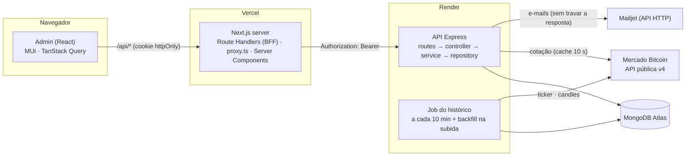
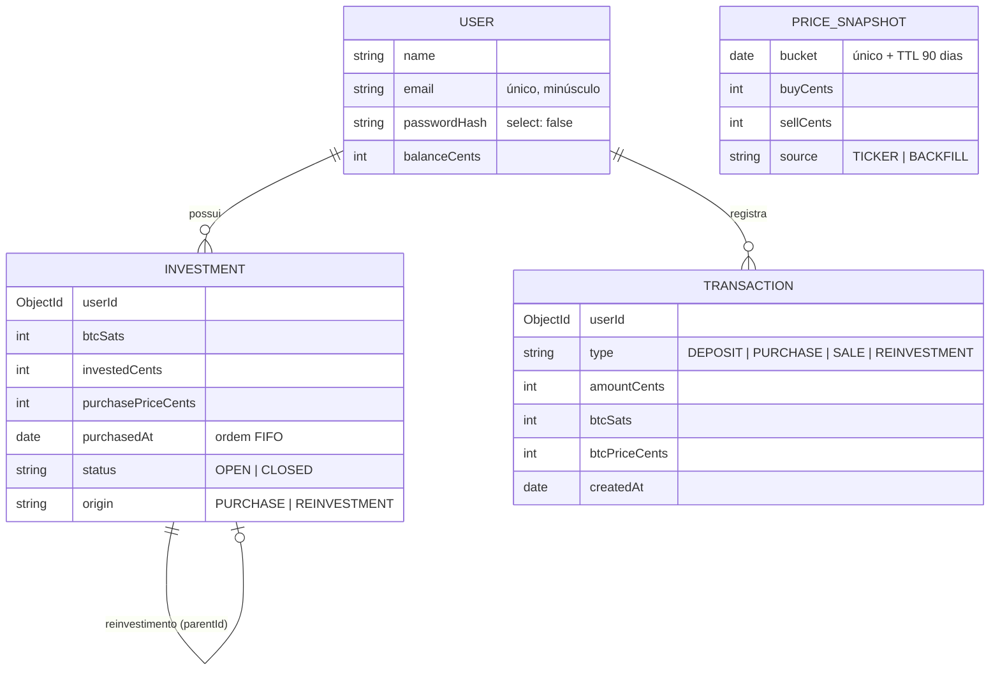
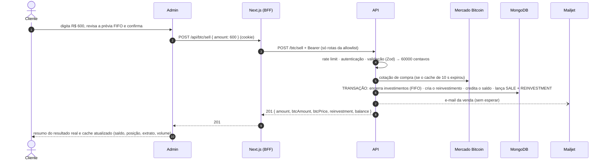

# Arquitetura

Como o Bitcoinzz é montado e por quê. Para rodar o projeto, veja o [README](../README.md) (inclusive o deploy); para desenvolver, o [CONTRIBUTING](../CONTRIBUTING.md).

## Visão geral



| Parte | Responsabilidade |
|---|---|
| Admin (navegador) | Telas, validação de formulários, cache e atualização automática dos dados, prévias de compra e venda |
| Next.js server (BFF) | Guarda o JWT em cookie httpOnly, repassa à API só as rotas permitidas, protege as páginas (`proxy.ts`) e lê o perfil em Server Component |
| API | Regras de negócio, autenticação, validação, persistência, integrações e Swagger (`/docs`) |
| Job do histórico | Grava a cotação a cada 10 min e completa as lacunas das últimas 24 h quando a API acorda |
| MongoDB | Usuários, investimentos, extrato e histórico; transações multi-documento; TTL de 90 dias no histórico |

## API

```
backend/
├── docs/openapi.yaml        # Swagger escrito à mão, servido em /docs (um teste confere que bate com as rotas)
└── src/
    ├── server.ts            # subida: variáveis → banco → job → listen; desligamento com calma (SIGTERM)
    ├── app.ts               # middlewares globais, rotas, /docs, 404 e tratador de erros
    ├── container.ts         # monta repositories → services → controllers (injeção de dependência manual)
    ├── config/              # env.ts (Zod), database.ts, logger.ts
    ├── shared/              # erros, middlewares HTTP, TransactionRunner, money.ts, dates.ts, format.ts
    └── modules/             # auth, account, users, quotes, investments, transactions, history, notifications, docs, health
```

- **Camadas:** a rota liga URL, middlewares (`authenticate`, `validate`) e controller. O controller só traduz HTTP. O service tem as regras e recebe as dependências pelo construtor, por isso é testado com fakes. Só o repository importa o Mongoose.
- **Erros:** os services lançam `AppError` (400, 401, 404, 409, 422, 429, 503). A resposta é sempre `{ statusCode, message, details? }`; erros do Zod viram 400 com `details` por campo; erros inesperados viram 500 e são logados com a stack. No Express 5, promessas rejeitadas chegam sozinhas ao tratador.
- **Transações:** `TransactionRunner.run(fn)` usa `connection.transaction()` com `transactionAsyncLocalStorage`: tudo dentro de `fn` entra na mesma transação sem passar a `session`, e conflitos transitórios são refeitos automaticamente.
- **Dinheiro:** R$ em centavos e BTC em satoshis (inteiros), com `BigInt` nas contas com preço (`shared/money.ts`). A API recebe e devolve decimais; a conversão acontece só nas bordas (schemas Zod e respostas).

## Dados



| Coleção | Índices | Para quê |
|---|---|---|
| `users` | `{ email }` único | Login e e-mail duplicado (409) |
| `investments` | `{ userId, status, purchasedAt }` | Posição e fila FIFO da venda |
| `transactions` | `{ userId, createdAt }` · `{ type, createdAt }` | Extrato por período · volume do dia |
| `pricesnapshots` | `{ bucket }` único **e** TTL de 90 dias | Job idempotente e expurgo automático |

- O BTC do cliente não fica no usuário: é a soma dos investimentos `OPEN` (fonte única da verdade).
- O saldo só muda de forma atômica (`$inc` com condição), na mesma transação do lançamento no extrato.

## Fluxo de uma venda



| Falha | Comportamento | O que o cliente vê |
|---|---|---|
| Sem sessão ou token inválido | `proxy.ts` redireciona; 401 da API apaga o cookie | Login (com aviso de sessão expirada) |
| Validação | 400 com `details` | Mensagem no campo |
| Valor acima da posição ou do saldo | 422 | Mensagem no formulário (a prévia já avisa antes) |
| Mercado Bitcoin fora do ar | 503 | "Cotação indisponível" com "Tentar de novo" |
| API fora do ar ou dormindo | BFF espera até ~90 s; depois, 503/504 | "Acordando o servidor…" e, se falhar, estados de erro com "Tentar de novo" |
| Escrita simultânea | Transação refeita automaticamente | Nada |
| Falha no envio do e-mail | Logada; a operação já foi concluída | Nada |

## Histórico de cotações

- **Coleta:** `node-cron` a cada 10 min (fuso de São Paulo, sem sobreposição) e uma vez na subida. Cada execução grava o slot atual com `upsert`; o índice único em `bucket` torna o job idempotente, mesmo com várias instâncias.
- **Backfill:** como a API dorme no plano gratuito, na subida ela preenche os slots vazios das últimas 24 h com uma única chamada a `/candles` (1 min). Cada slot recebe o último candle fechado antes dele (só há candle em minutos com negociação). Esses pontos são `BACKFILL` e aproximados: candle é preço negociado, então compra = venda.
- **Expurgo:** o mesmo índice de `bucket` é TTL de 90 dias; o próprio MongoDB apaga os registros antigos.
- **Falhas:** viram aviso no log e nunca derrubam a API; o próximo backfill cobre o slot perdido.

## Admin (Next.js)

```
frontend/src/
├── app/            # (auth) login · register | (app) dashboard · deposit · buy · sell · statement | api/* (BFF) | not-found
├── proxy.ts        # protege as páginas (sem sessão → login; logado em /login → dashboard)
├── server/         # BFF: allowlist, repasse à API, cookie de sessão, checagem de origem
├── features/       # auth · dashboard · trade (depósito, compra, venda) · statement
├── components/     # AppShell, StatCard, MoneyField, ConfirmDialog, FocusGroup...
├── lib/            # api-client, format (pt-BR), money (centavos/satoshis), dates (dia em SP), query-keys
└── theme/          # tokens e tema MUI (dark, vidro, blurple)
```

- **Sessão (BFF):** o login grava o JWT no cookie `bitcoinzz_session` (`HttpOnly`, `Secure` em produção, `SameSite=Lax`, 8 h); o token nunca volta para o navegador. `/api/[...path]` aceita só a allowlist exata (método + caminho), exige o cookie e repassa com `Authorization: Bearer` para `API_URL` (variável só de servidor). POSTs com `Origin` de outro host recebem 403. Logout e sessão expirada fazem recarga completa, para não sobrar dado do usuário anterior em memória.
- **Dados:** TanStack Query. Cotação a cada 15 s; posição e volume a cada 30 s; histórico a cada 60 s; saldo e extrato ao abrir a tela e depois de cada operação. As mutations atualizam o saldo com a própria resposta e invalidam posição, volume e extrato.
- **Prévias:** compra e venda (inclusive o plano FIFO) são calculadas no front com as mesmas regras, arredondamentos e mensagens da API (`lib/money.ts`, `features/trade`). A API continua sendo a autoridade: a tela de sucesso mostra o resultado devolvido por ela.
- **Renderização:** Cache Components ligado. A casca das páginas sai pronta no HTML e o nome do usuário chega em streaming (`UserBadge` em `<Suspense>`). Componentes pré-renderizados não leem a hora no render: o relógio vem de `useSyncExternalStore` (`lib/use-now.ts`).
- **Visual:** só tokens de `theme/tokens.ts`; grupos de cards e botões usam `FocusGroup`; animações respeitam "reduzir movimento".

## Segurança

| Ameaça | Controle |
|---|---|
| Roubo de token (XSS) | JWT só em cookie httpOnly; o JavaScript da página nunca o lê |
| CSRF | `SameSite=Lax` + checagem de `Origin` nos POST do BFF |
| Força bruta no login | 10 erros por e-mail a cada 15 min (atrás do BFF todos chegam com o IP da Vercel); cadastro limitado por IP; 300 req/15 min por usuário |
| Enumeração de usuários | Mensagem genérica e tempo de resposta igual (hash fictício quando o e-mail não existe) |
| Senhas vazadas | bcrypt (custo 10); `passwordHash` com `select: false` |
| Entrada maliciosa | Zod em todo body e query; corpo limitado a 10 kB |
| Headers e proxy | helmet; `trust proxy` só em produção; `x-request-id` aceito só se for alfanumérico |
| Segredos | Só em variáveis de ambiente (fora do git e das imagens Docker); `env.ts` valida na subida |
| Dados em logs | `redact` do pino em `authorization`, `password` e cookies |
| Banco exposto | Atlas libera só as faixas de IP de saída do Render, além da senha |

## Decisões-chave

| Decisão | Por quê |
|---|---|
| MongoDB com transações (replica set) | Saldo, investimentos e extrato mudam juntos ou não mudam; TTL nativo para o histórico |
| Dinheiro em inteiros (centavos e satoshis) | Exatidão sem biblioteca de decimais; nunca `toFixed` para calcular |
| Venda parcial gera reinvestimento com a cotação e a data originais | Nenhum BTC é criado ou perdido, e a fila FIFO continua correta |
| Compra e venda usam a cotação do cache (até 10 s) | É a mesma que o cliente vê na prévia e respeita o limite de 1 req/s do Mercado Bitcoin |
| Cotação pelo endpoint v4 do Mercado Bitcoin | A URL v3 do enunciado não consta mais na documentação oficial |
| JWT em cookie httpOnly via BFF, sessão de 8 h sem refresh token | Protege o token contra XSS e esconde a URL da API; simples de manter |
| Rate limit do login por e-mail | Atrás do BFF o IP é sempre o da Vercel; repassar o IP do cliente permitiria falsificação |
| Swagger escrito à mão + teste de contrato | Fácil de ler neste tamanho de API; o teste impede que a doc e as rotas divirjam |
| Sem keep-alive no Render | Não gasta as horas grátis; o backfill e o pré-aquecimento na tela de login compensam |
| TypeScript fixado em 6.0.x | O typescript-eslint ainda não suporta o TypeScript 7 |
| Cache Components ligado no Next 16 | Padrão do Next daqui em diante; leituras de cookie ficam em `<Suspense>` |
| API configurada por `render.yaml` e deploy só com o CI verde | Infraestrutura versionada; nada quebrado chega à produção |

## Integrações externas

Serviços de terceiros mudam limites, preços e APIs. Ao mexer em uma integração, confira a documentação oficial e atualize a data desta tabela.

| Serviço | Uso no projeto | Limites e cuidados | Documentação | Verificado em |
|---|---|---|---|---|
| Mercado Bitcoin (API v4) | `GET /tickers?symbols=BTC-BRL` (cotação) e `GET /candles` (backfill) | 1 req/s por endpoint; valores vêm como texto; só há candle em minutos com negociação | [api v4](https://api.mercadobitcoin.net/api/v4/docs) | 06/10/2026 |
| MongoDB Atlas (M0) | Banco de produção | 0,5 GB; pausa após 30 dias sem uso; lista de IPs aceita faixas CIDR | [limites do M0](https://www.mongodb.com/docs/atlas/reference/free-shared-limitations/) · [lista de IPs](https://www.mongodb.com/docs/atlas/security/ip-access-list/) | 08/10/2026 |
| Render (free) | API (`render.yaml`) | Dorme após 15 min sem tráfego (~1 min para acordar); 750 h/mês por conta; IPs de saída fixos por região e compartilhados; **portas de SMTP (25, 465, 587) bloqueadas**, por isso o e-mail sai por API HTTP | [plano free](https://render.com/docs/free) · [IPs de saída](https://render.com/docs/outbound-ip-addresses) · [Blueprint](https://render.com/docs/blueprint-spec) | 09/10/2026 |
| Vercel (Hobby) | Admin (Root Directory `frontend`) | Uso pessoal e não comercial; funções até 300 s | [plano Hobby](https://vercel.com/docs/plans/hobby) | 08/10/2026 |
| Mailjet (free) | E-mails pela Send API v3.1 (`POST https://api.mailjet.com/v3.1/send`, autenticação Basic com a chave pública e a privada) | 6.000 e-mails/mês e 200/dia, sem prazo; remetente validado por e-mail (não exige domínio próprio); sem domínio próprio pode cair no spam; erros 400/401/403 com `ErrorMessage` | [preços](https://www.mailjet.com/pricing/) · [Send API v3.1](https://dev.mailjet.com/email/guides/send-api-v31/) · [validação de remetente](https://dev.mailjet.com/docs/email-api/senders-domains/sender-validation) | 09/10/2026 |
| GitHub Actions | CI (lint, tipos, testes e build) | Grátis para repositório público; `actions/checkout@v7` e `actions/setup-node@v7` | [setup-node](https://github.com/actions/setup-node) | 08/10/2026 |
